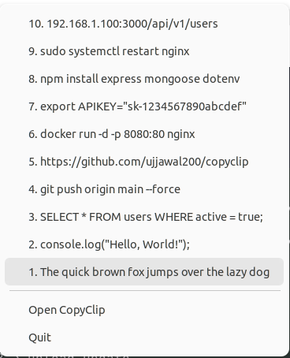
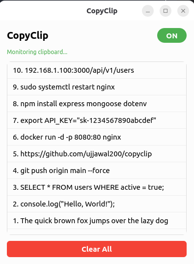
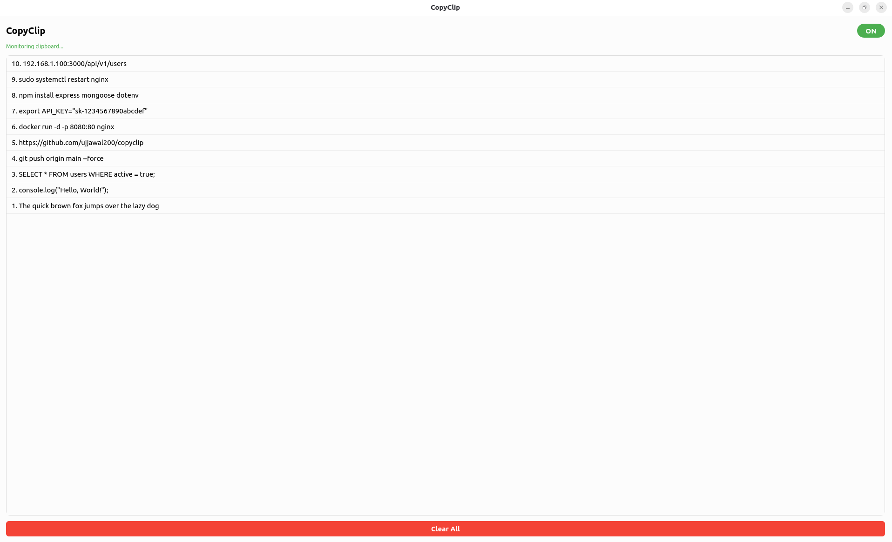

# CopyClip

A lightweight clipboard history manager for Linux. Lives in your system tray — click to access your last 20 copied texts instantly.

Built for developers and coders who copy-paste frequently.

## Features

- 🔄 Monitors clipboard in real-time (polls every 500ms)
- 📋 Stores last 20 copied texts
- 🖱️ System tray icon — click to see history & re-copy
- 🖥️ Full app window with ON/OFF toggle
- 🗑️ Clear history with one click
- 💾 Persists across restarts (SQLite)
- 🐧 GNOME compatible (uses xclip for reliable clipboard access)

## Screenshots

### Tray Dropdown


### App Window


### Full Screen


## Installation

```bash
# Install system dependency
sudo apt install xclip

# Clone
git clone https://github.com/ujjawal200/copyclip.git
cd copyclip

# Install Python dependencies
pip install -r requirements.txt

# Run
python main.py
```

## Usage

1. Run `python main.py` — a clipboard icon appears in your system tray
2. Copy text anywhere — CopyClip saves it automatically
3. Click the tray icon — see your last 20 clips, click any to re-copy
4. Right-click tray → "Open CopyClip" for the full app window
5. Toggle ON/OFF to pause/resume monitoring

## Tech Stack

- **Language**: Python 3
- **UI**: PyQt6 (system tray + window)
- **Clipboard**: xclip (reliable on GNOME/KDE/XFCE)
- **Storage**: SQLite (~/.copyclip/history.db)

## Requirements

- Linux (Ubuntu, Fedora, Arch, etc.)
- Python 3.10+
- xclip (`sudo apt install xclip`)
- System tray support (GNOME with AppIndicator, KDE, XFCE, etc.)

## Project Structure

```
copyclip/
├── main.py              # Entry point
├── clipboard_monitor.py # Polls clipboard via xclip
├── database.py          # SQLite storage (20 item limit)
├── tray.py              # System tray icon + dropdown menu
├── window.py            # Full app window (toggle, list, clear)
├── resources/icon.png   # Tray icon
└── requirements.txt     # PyQt6
```

## License

MIT
